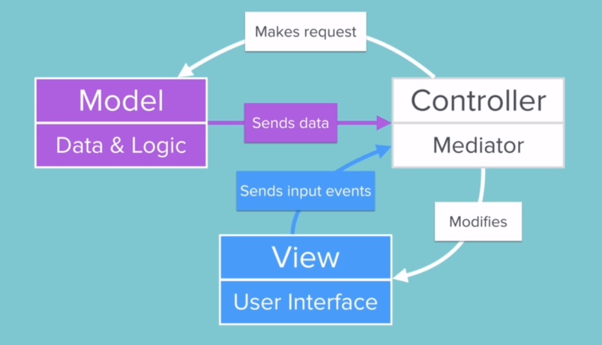

# Banshee-iOS

<!-- TABLE OF CONTENTS -->
## Table of Contents

* [About the Project](#about-the-project)
  * [Built With](#built-with)
* [Tools](#tools)
* [Installation](#installation)
* [Developer Pattern](#developer-pattern)
* [GitHub Work Flow](#github-work-flow)
* [Usage](#usage)
    * [Helpful Commands](#helpful-commands)
* [License](#license)
* [Contact](#contact)

## About The Project
Banshee-iOS is the iOS client-side development for the Banshee Server. Development for this project requires the use of a Mac using Xcode.
This is a work in progress...
* macOS

### Built With
Banshee-iOS is built using Swift 
* [Swift](https://swift.org/)

## Tools
* [Xcode](https://developer.apple.com/support/xcode/)

## Installation
1. Through Xcode, clone this project using HTTPS

## Developer Pattern
This project utilizes the MVC design pattern


## GitHub Work Flow
1. Clone repository using HTTPS
```sh
git clone https://github.com/elavertu9/Banshee.git
```
2. Navigate into the root of the Banshee directory
3. Branch the code base
```sh
git branch <branch-name>
```
4. Checkout newly created branch
```sh
git checkout <branch-name>
```
5. Satisfied with changes? Need to add changes, commit, and push
```sh
git add <file-name(s)>
```
```sh
git commit -m"detailed commit message"
```
```sh
git push
```
6. To place your changes into master, navigate to the repository on GitHub and create a pull request out of your recently pushed changes. Wait for a reviewer to merge the code.
7. If your master branch is out of date, you can run
```sh
git pull upstream master
```
8. From your branch
```sh
git merge master
```

## Usage
After installation, using Xcode...
1. Select the device you would like to run the application on next to the play button
2. Press the play button
    * The first time you do this, it will take some time to initialize
### Helpful Commands
Refresh Xcode cache
```text
rm -rf ~/Library/Developer/Xcode/DerivedData
```


## License
No license yet

## Contact
Website - [www.lavertu.dev](https://www.lavertu.dev)

Project Link: [Banshee-iOS](https://github.com/elavertu9/Banshee-iOS)
